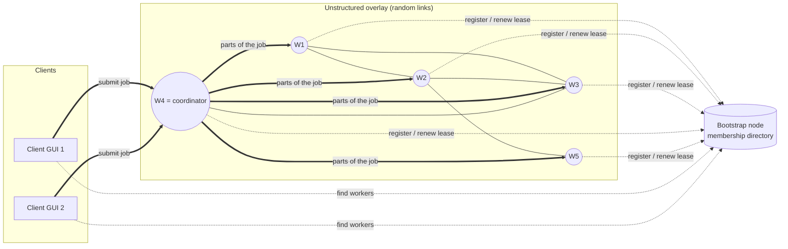

# DistriLab: a distributed computing cluster in Java RMI

CS324 Distributed Systems, Assignment 1 (Part 2: implementation).

DistriLab is an **unstructured network of worker processes** that talk to each other with **Java RMI**. The workers elect a **coordinator**. The coordinator accepts jobs from **client GUIs**, splits each job evenly across the available workers, and combines their partial results. A **bootstrap node** keeps the list of active workers. It takes no part in elections or computation.

| Job | Meaning | Example |
|---|---|---|
| `MAX(numbers)` | Largest value in an unsorted list (decimals allowed) | `MAX(17, 99.5, -3)` = 99.5 |
| `PRIMESUM(start, end)` | Sum of all primes in the range | `PRIMESUM(1, 1000)` = 76127 |
| `PRIMECOUNT(numbers)` | How many values in the list are prime | `PRIMECOUNT(2, 4, 7, 9)` = 2 |

The coordinator splits `PRIMESUM(1, 1000)` over 4 workers exactly as the brief describes: `w1:PRIMESUM(1,250) + w2:PRIMESUM(251,500) + w3:PRIMESUM(501,750) + w4:PRIMESUM(751,1000)`.


---

## Contents

1. [What you need](#1-what-you-need)
2. [Quick start on Windows](#2-quick-start-on-windows)
3. [Quick start on macOS or Linux](#3-quick-start-on-macos-or-linux)
4. [Starting each part by hand (step by step)](#4-starting-each-part-by-hand-step-by-step)
5. [Using the client GUI](#5-using-the-client-gui)
6. [Command-line client and worker console](#6-command-line-client-and-worker-console)
7. [Running across several computers](#7-running-across-several-computers)
8. [Configuration](#8-configuration)
9. [Testing and demonstration](#9-testing-and-demonstration)
10. [How it works](#10-how-it-works)
11. [Project structure](#11-project-structure)
12. [Troubleshooting](#12-troubleshooting)

---

## 1. What you need

* **To run:** Java 8 or newer. The project includes a ready-built `distrilab.jar`, so an ordinary Java runtime (JRE) is enough.
* **To rebuild from source:** a JDK 9 or newer (17 or 21 recommended), because the build uses `javac --release 8` and `jar`.
* No other libraries. Everything uses the JDK: RMI, Swing and `java.util.concurrent`.

Check that it is installed:

```
java -version
javac -version
```

`java -version` should print 1.8 or higher. `javac` is only needed to rebuild. If Java is installed but not on `PATH`, the Windows scripts still find it (they check `JAVA_HOME` and the usual install folders). If you have no Java at all, install Eclipse Temurin 21 from adoptium.net.

## 2. Quick start on Windows

Open **Command Prompt** in the project folder (the one that contains this README):

```bat
scripts\build.bat
scripts\demo.bat
```

`build.bat` compiles everything into `distrilab.jar`. It needs a JDK; skip it if you only have a Java runtime, because a ready-built jar is included. `demo.bat` opens six windows:

* **DistriLab Bootstrap**: the bootstrap node (registry on port 1099).
* **DistriLab Worker 1 … 4**: four workers. Worker 1 starts first, finds itself alone and elects itself coordinator for term 1.
* **DistriLab Client**: the client GUI.

In the client, press **Submit job** to run `PRIMESUM(1, 1000)`. The *Details* tab shows how the job was split. Submit five more jobs, or set *Copies to submit at once* to 6. After five jobs the term ends, a new election runs, and a different worker becomes coordinator (watch the *Coordinator / term* column).

To stop everything, run `scripts\stop-demo.bat` or close the windows. `scripts\demo.bat 6` starts six workers instead of four.

With the cluster running, you can also double-click `scripts\try-jobs.bat`. It shows the cluster status, runs `PRIMESUM(1,1000)` and the 12-job batch file from the command line, and keeps its window open so you can read the results.

> The first time Java opens a network port, Windows Firewall may ask for permission. For a single-computer demo, "Private networks" is enough.

## 3. Quick start on macOS or Linux

```sh
scripts/build.sh
scripts/demo.sh          # bootstrap node + 4 workers in the background, then the client GUI
scripts/stop-demo.sh     # stop them all
```

Background process logs go to `logs/demo/` (for example `tail -f logs/demo/worker-1.log`). Run `scripts/demo.sh 6` for six workers, or `scripts/demo.sh 4 --no-gui` to skip the GUI.

## 4. Starting each part by hand (step by step)

This is what the demo scripts do. Use one terminal per process so you can watch each log. Every command runs from the project folder. Use `scripts\*.bat` on Windows and `scripts/*.sh` elsewhere. You can also call `java -jar distrilab.jar …` directly.

**Step 1: build (once, and again after any code change)**

```
scripts\build.bat                     (Windows)
scripts/build.sh                      (macOS/Linux)
```

**Step 2: start the bootstrap node (terminal 1)**

```
java -jar distrilab.jar bootstrap
```

It prints `Bootstrap node ready ... port 1099`. Leave it running. Type `list` in this window to see the registered workers.

**Step 3: start workers (one terminal each)**

```
java -jar distrilab.jar worker --id=1
java -jar distrilab.jar worker --id=2
java -jar distrilab.jar worker --id=3
java -jar distrilab.jar worker --id=4
```

* IDs must be unique positive integers. If you leave out `--id`, the bootstrap node assigns the next free ID.
* Each new worker registers with the bootstrap node and **links to a random active worker**. With the default `overlay.linksPerJoin=2` it also makes one extra random link, so the network has cycles.
* The first worker finds no coordinator and elects itself. Later workers learn the current coordinator from their neighbour.
* Type `status` in a worker window to see its ID, JAC, role, term, neighbours and task counters.

**Step 4: start one or more clients (one terminal each)**

```
java -jar distrilab.jar client
```

Start this command several times to get several independent clients (separate JVM processes). Every client can submit jobs at the same time.

**Step 5: stop**

Press `Ctrl+C` or type `quit` in a worker window. The worker leaves gracefully: it unregisters, tells its neighbours, and if it was the coordinator it asks a neighbour to hold an election straight away. Killing a worker abruptly also works: the others detect the failure with heartbeats.

### Running from VS Code

1. Open the project folder in VS Code (**File → Open Folder… → DistriLab**).
2. Open a terminal (**Terminal → New Terminal**) and run `scripts\demo.bat` (Windows) or `scripts/demo.sh` (macOS/Linux).
3. Alternatively, run each process in its own terminal pane: split the terminal with Ctrl+Shift+5 and run the commands from steps 2–4 above, one per pane.

## 5. Using the client GUI

| Area | What it does |
|---|---|
| **Bootstrap node** + **Connect** | Where to find the cluster (default `127.0.0.1:1099`). |
| **Coordinator** label | The current coordinator and term, refreshed every few seconds. |
| **Network status…** | Table of every worker (JAC, role, term, neighbours, tasks done, peak concurrent tasks, elections processed and duplicates ignored), plus an agreement check and an overlay connectivity check. |
| **Job type** | `MAX`, `PRIMESUM` or `PRIMECOUNT`. |
| **Manual entry** | For `PRIMESUM` type *Start* and *End*. For list jobs type numbers separated by commas, spaces or new lines. |
| **Load CSV…** | Reads every numeric cell of a CSV file and skips headers and text. For `PRIMESUM` the first two numbers become start and end. Try `data/numbers-small.csv`, `data/numbers-10000.csv` and `data/primesum-range.csv`. |
| **Random…** | Generates a list of random numbers (useful for big `PRIMECOUNT` jobs). |
| **Copies to submit at once** | Submits the same job N times **concurrently** from this one client. |
| **Submit batch CSV…** | Submits one job per line concurrently, e.g. `data/jobs-batch.csv` (12 mixed jobs, so you see at least two elections). Format: `TYPE,arg1,arg2,...`. |
| **Jobs table** | One row per job: status, result, coordinator/term/job number in the term, workers used and time. Select a row to see the full split and per-worker partial results under **Details**. |

Every job runs on its own background thread, so the window stays responsive while many jobs are in flight.

## 6. Command-line client and worker console

The command-line client is useful for scripted tests and quick checks:

```
java -jar distrilab.jar cli status                         # all workers, agreement and connectivity
java -jar distrilab.jar cli coordinator                    # who is the coordinator
java -jar distrilab.jar cli submit PRIMESUM 1 1000
java -jar distrilab.jar cli submit MAX 17,4,99.5,-12
java -jar distrilab.jar cli submit PRIMECOUNT 2 3 4 5 6 7
java -jar distrilab.jar cli csv PRIMECOUNT data/numbers-10000.csv
java -jar distrilab.jar cli batch data/jobs-batch.csv      # 12 jobs at once
java -jar distrilab.jar cli repeat 8 PRIMESUM 1 5000000    # 8 copies at once
```

Worker console commands (type in a worker's window): `status`, `neighbours`, `elect` (force an election, for demonstrations) and `quit`.

Bootstrap console commands: `list`, `quit`.

## 7. Running across several computers

All computers must be on the same network and able to reach each other. Suppose the bootstrap node runs on `192.168.1.20` and a worker on `192.168.1.21`.

1. **Find each machine's IP**: run `ipconfig` on Windows and read the IPv4 Address, or `ip addr` / `ifconfig` on macOS and Linux.
2. **Bootstrap computer:**
   ```
   java -jar distrilab.jar bootstrap --host=192.168.1.20
   ```
3. **Each worker computer:** `--host` is the worker's own IP and `--bootstrap` is the bootstrap computer:
   ```
   java -jar distrilab.jar worker --id=1 --host=192.168.1.21 --bootstrap=192.168.1.20:1099
   ```
4. **Each client computer:**
   ```
   java -jar distrilab.jar client --bootstrap=192.168.1.20:1099
   ```
   You can also type the address into the GUI and press **Connect**.
5. **Firewall:** allow Java through the firewall, or open TCP port 1099 on the bootstrap computer. Workers use a random port by default. For a strict firewall, give each worker a fixed port with `--port=5001` and open that port.

Instead of passing options each time, you can set `bootstrap.host` and `rmi.hostname` in `config/distrilab.properties` on each machine.

`--host` sets `java.rmi.server.hostname`: the address written into this process's RMI stubs, which other machines use to call it back. With the default `127.0.0.1` everything works on one computer, but other machines cannot connect. This is the most common cause of multi-machine problems.

## 8. Configuration

Settings are layered:

1. Built-in defaults: `src/main/resources/distrilab-defaults.properties`, packaged in the jar.
2. `config/distrilab.properties`, read automatically when you run from the project folder. `--config=path` picks another file.
3. Command-line options `--key=value`. These win.

Misspelt keys are rejected with an error. The most useful settings:

| Key | Default | Meaning |
|---|---|---|
| `bootstrap.host` / `bootstrap.port` | `127.0.0.1` / `1099` | Where the bootstrap node's RMI registry is (`--bootstrap=host:port`) |
| `rmi.hostname` | `127.0.0.1` | This machine's address as seen by others (`--host=IP`) |
| `worker.id` | `0` (auto) | Worker ID (`--id=N`) |
| `worker.port` | `0` (any) | Port the worker's remote object listens on (`--port=N`) |
| `worker.threads` | `4` | Threads per worker for running sub-tasks concurrently (`--threads=N`) |
| `worker.heartbeatIntervalMs` | `2000` | How often neighbours and the coordinator are pinged |
| `overlay.linksPerJoin` | `2` | Links a new worker makes: 1 = exactly one random active worker, 2 = one extra random link for cycles |
| `coordinator.maxJobsPerTerm` | `5` | Jobs a coordinator may assign in one term |
| `coordinator.includeSelf` | `true` | Whether the coordinator also computes a share of each job |
| `coordinator.maxTaskAttempts` | `3` | Remote attempts per sub-task before the coordinator computes it itself |
| `election.timeoutMs` | `10000` | Maximum time an election wave waits for replies |
| `election.jitterMaxMs` | `600` | Random delay before starting a failure-triggered election |
| `bootstrap.leaseTimeoutMs` | `10000` | A worker that stops renewing its lease is removed after this time |
| `jobs.maxListSize`, `jobs.maxPrimeSumRange`, `jobs.maxPrimeSumEnd` | 5 M, 10^9, 10^12 | Input limits |
| `client.threads` | `8` | Jobs one client runs at the same time |
| `log.debug` | `false` | Extra logging and stack traces (`--debug`) |

## 9. Testing and demonstration

### Automated tests

```
java -jar distrilab.jar test            # 14 unit tests, under a second
java -jar distrilab.jar cluster-test    # starts its own bootstrap node + 5 workers on port 1299 (well under a minute)
```

Or run `scripts\run-tests.bat` / `scripts/run-tests.sh` to build and run both. The cluster test checks all of the following and writes each process's log to `logs/cluster-test/`:

* The overlay is connected and every worker has neighbours.
* All workers agree on one coordinator.
* `PRIMESUM(1,1000)` = 76127 and is split into equal ranges.
* After 5 jobs a new election runs and **Worker 5 wins the JAC tie (highest ID)**, while Worker 1's JAC is 5.
* 10 concurrent jobs from two clients all return correct results, with at most 5 jobs and exactly one coordinator per term.
* Leadership rotates by the JAC rule.
* Two separate client processes run at the same time.
* Workers ran several tasks concurrently.
* Duplicate ELECTION messages were detected and ignored.
* When the coordinator is killed, a new one is elected and jobs still complete.
* When the bootstrap node is killed, elections and job processing continue.

### Manual demo checklist (about 5 minutes)

1. `scripts\demo.bat`. In worker windows, the first worker logs `*** I am the COORDINATOR for term 1`.
2. **Job splitting.** Submit `PRIMESUM 1 1000`. The *Details* tab shows `w1:PRIMESUM(1,250) + … + w4:PRIMESUM(751,1000)`, and each worker window logs its own `Task … started/finished` line.
3. **Terms and the JAC.** Set *Copies* to 6 and submit. Five jobs go to the current coordinator. Its log says `Term 1 is complete (5 of 5 jobs assigned) - starting the next election`. The sixth job goes to the new coordinator.
4. **Election details.** In worker logs, look for `ELECTION … received from Worker X - my ballot: Worker N (JAC j); forwarding to [...]` and `ELECTION … from Worker Y ignored - already processed` (duplicate suppression). Then `COORDINATOR: Worker N … is the coordinator for term T`.
5. **Tie-break.** When several workers have the same lowest JAC, the one with the highest ID wins. Check with **Network status…**.
6. **Concurrency.** Use *Random…* with 1,000,000 numbers and PRIMECOUNT, *Copies* 4, then submit. Worker logs show `(n task(s) now running on this worker)` with n > 1 and different `task-W…` thread names.
7. **Multiple clients.** Start a second client and submit from both at once.
8. **Fault tolerance.** Close the coordinator's window. Within a few seconds the others log `Coordinator … is unreachable`, hold an election, and your next job completes on the new coordinator.
9. **Bootstrap independence.** Close the bootstrap window. Jobs and elections still work; only new workers cannot join. Restart it and the workers re-register automatically through their leases.

## 10. How it works



* **Bootstrap node:** an RMI registry plus a membership service. Workers register and then renew a *lease* every 3 s. A worker that stops renewing is dropped. A new worker receives one random active worker to link to. The bootstrap node never takes part in elections or jobs.
* **Unstructured overlay:** each worker keeps its own neighbour list. Links are made at random on join and repaired at random when a neighbour fails, so workers end up with different numbers of neighbours.
* **Leader election** (`ElectionManager`): an echo, or wave, algorithm. The ELECTION message floods the overlay. Each worker processes a given election ID only once. Its reply carries the best candidate found in its part of the network back towards the initiator. The rule is **lowest JAC wins, and ties go to the highest ID**. The initiator then floods a COORDINATOR message with the new term number.
* **Terms and the JAC** (`JobCoordinator`): a coordinator may assign 5 jobs per term. Every job it assigns increments its **Job Allocation Counter (JAC)**. The 5th job closes the term and the coordinator starts the next election. Because leading raises the JAC, the role rotates.
* **Job processing:** `Job` is an abstract, serialisable class. `MaxJob`, `PrimeSumJob` and `PrimeCountJob` implement `split`, `compute` and `combine`, so the coordinator distributes jobs without knowing their type. Parts are dispatched in parallel. If a worker fails, its part is reassigned.
* **Concurrency:** RMI serves calls on many threads. Each worker also runs sub-tasks on a fixed thread pool, and each client submits jobs on its own thread pool. Shared state uses `ConcurrentHashMap`, atomics, and small `synchronized` sections. No lock is ever held during a remote call.

### Interpretation choices (stated so they can be checked)

* **JAC:** incremented once per client job that the coordinator assigns to the cluster, at the moment it accepts the job. This is the same unit as the 5-jobs-per-term limit.
* **The coordinator computes a share** of each job by default (`coordinator.includeSelf=true`), because it is also a worker. Set it to `false` to have it only coordinate.
* **Links on join:** the brief requires a random link to one active worker. By default each new worker also makes one extra random link, so the network is a true unstructured graph with cycles. `overlay.linksPerJoin=1` gives the minimal behaviour.

## 11. Project structure

```
DistriLab/
├── README.md                 this file
├── config/distrilab.properties   deployment settings (edit this)
├── data/                     sample CSV inputs and a batch file
├── scripts/                  build / demo / start / test scripts (.bat for Windows, .sh for macOS/Linux)
└── src/main/
    ├── resources/distrilab-defaults.properties
    └── java/distrilab/
        ├── Launcher.java             single entry point (bootstrap | worker | client | cli | test | cluster-test)
        ├── api/                      remote interfaces, exceptions, serialisable messages
        ├── bootstrap/                bootstrap node (lease-based membership)
        ├── worker/                   worker node: overlay, election, coordinator role, task pool, heartbeats
        ├── jobs/                     Job hierarchy, prime maths, input parsing, CSV loading
        ├── client/                   ClusterClient, CLI, network report
        │   └── gui/                  Swing client
        ├── net/                      RMI helpers (timeouts, bootstrap lookup)
        ├── util/                     configuration, logging, thread helpers
        └── selftest/                 unit tests and end-to-end cluster test
```

## 12. Troubleshooting

| Problem | Fix |
|---|---|
| `javac is not recognized` | Only needed to rebuild: the included `distrilab.jar` runs without it. To rebuild, install a JDK 9+ and add its `bin` folder to `PATH`. |
| `UnsupportedClassVersionError` | The jar was built with a newer JDK than the one running it. Run `scripts/build` with the same JDK. |
| `Could not open the RMI registry port` | Another bootstrap node (or `rmiregistry`) is already using port 1099. Stop it, or use `--port=2000` and give workers and clients `--bootstrap=127.0.0.1:2000`. |
| `Could not reach the bootstrap node` | Start the bootstrap node first, and check `bootstrap.host`/`bootstrap.port`. Workers retry for about 15 s on start-up. |
| `Worker ID 3 is already used` | Pick another `--id`, or leave `--id` out for automatic IDs. |
| Works on one PC but not across PCs | Give every bootstrap and worker process `--host=<its own LAN IP>` and allow Java through the firewall (see section 7). |
| `No graphical display` | Use the command-line client: `java -jar distrilab.jar cli …`. |
| Client shows "Waiting for a coordinator" | An election is in progress. It finishes in well under a second on a LAN, and the client retries automatically. |
